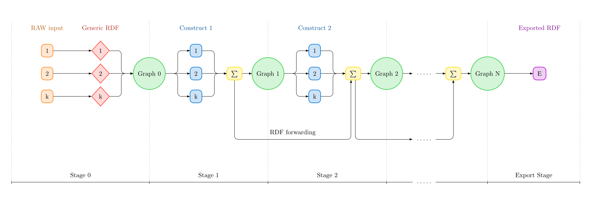

The Resource Description Framework (RDF) is a W3C standard for modeling data as a graph, with nodes that represent entities and edges that represent relationships between those entities. Existing heterogeneous data often needs to be transformed to RDF. However, when you are tasked with converting existing data from multiple different sources and file formats into a well-structured RDF graph, you may ask yourself - well - how best to do this? In this article, I introduce Qonstructor, a domain-independent RDF generation pipeline.

<!--more-->

You can find the source code in this [GitHub repository](https://github.com/WissenUberDenWaldImWandel/qonstructor).

## Introduction

In the world of relational databases - the evil enemy of the graph world - there are many open-source industry standards for data transformation pipelines. One of them is DBT (Data Build Tool), which is used for SQL-based transformation orchestration.

In the RDF world, there are also many tools that can convert raw data into RDF. For example, tools based on the RML mapping standard, such as Morph-KGC. However, there are not many tools designed to convert multiple different files from different formats into one structured knowledge graph.
The goal of this project was to create a pipeline that can be used to build RDF graphs from heterogeneous raw data. This pipeline was needed for the WWW-4.0 project (Wissen über den Wald im Wandel). But the goal was to build a domain-independent pipeline that can also be used for different projects.

I could have used existing tools like Morph-KGC in different parts of the pipeline. But the problem with those tools is that they are generally pretty slow. The alternative was to first convert all of the raw data into generic RDF and then use native RDF technology such as construct-queries to transform the data. Construct-queries are queries on an RDF graph that return a new RDF graph. With this general idea in mind, I designed Qonstructor. In this blog post, I will give a general overview of the architecture and usage of Qonstructor.

## Qonstructor architecture

Qonstructor is a Python program that orchestrates different external software such as QLever, an efficient RDF database engine. When Qonstructor starts, it first parses and validates all configs. Then it runs its sequential stages.

Stage 0 is the generic-generation-stage. It converts raw data into generic RDF by utilizing generator programs. Qonstructor contains generator programs for CSV, JSON and GeoTIFF files. Custom generator programs can be added to the pipeline. How each source file is converted is defined in the configs. At the end of the stage, a QLever index is built from the resulting generic RDF and a QLever server is started.

Stages 1-9 are the construct-stages. Each construct-stage executes construct-queries on the QLever server from the stage before. The construct-queries for every stage are also defined in the configs. The resulting RDF of the construct-queries from this stage then gets combined with the RDF of all previous construct-stages. I call this RDF-forwarding. A new QLever index is built and a new server is started from this. This results in a separation of the generic RDF and the final RDF. All data that should go from the generic RDF to the final RDF needs to be manually generated with construct-queries of the first stage. Construct-stages 2-9 only enrich the final RDF by adding triples.

There is one final stage called the export-stage, where a single construct-query is run on the last QLever server. The export-query can also be defined in the configs. This step yields one compressed N-Triples file (`final.nt.gz`) that can then be used for different applications. The default export-query just exports all triples, but it can be changed, for example to filter for specific triples.

The following pipeline diagram visualizes this architecture:



A few questions about this architecture might arise.

**Reproducibility:**
Qonstructor is designed as a Docker container. Docker Compose is used to easily start the Qonstructor container and a separate QLever UI container at the same time. A Makefile simplifies those actions.

**Observability:**
The QLever UI is accessible the whole time. The QLever servers of the stages are only stopped once the pipeline is rerun or the pipeline container is stopped. This enables manual testing of the stages with SPARQL queries during the whole pipeline lifecycle.

**Why are multiple construct-stages needed?** Well, there might be construct-queries that depend on triples that need to be generated by other construct-queries.

**Why are construct-queries used and not update-queries?** Update-queries cannot be run in parallel by the QLever server, because the execution order might change the output of the queries. Construct-queries, on the other hand, can run in parallel. This means that when you want to run many queries that yield large outputs, using construct-queries and later rebuilding the QLever index might be faster.

## Example-Workspace

All persistent data like config files and the resulting RDF of Qonstructor is located in the workspace folder. Qonstructor comes with an example-workspace that is designed to explain the config structure and architecture of Qonstructor. Qonstructor can be executed on this example-workspace, which only takes a few seconds to fully finish. In this section, I will explain the example-workspace.

### Pipeline-Configuration-File

The example-workspace contains the default pipeline-configuration file for Qonstructor, where global settings can be adjusted:

```yaml
construct_workers: 4
generic_workers: 4

generators:
  csv: "csv2rdf2 {{ flags }} -n {{ name }} {{ source_file }} | gzip -1 -c > {{ target_file }}"
  json: "json2rdf {{ source_file }} | gzip -1 -c > {{ target_file }}"
  tif: "tif2rdf {{ source_file }} | gzip -1 -c > {{ target_file }}"

qlever:
  stxxl_memory: 10G
  memory_for_queries: 20G
  cache_max_size: 10G
  cache_max_size_single_entry: 5G
  timeout: 2000s
  access_token: 1234abcd
  vocabulary_type: in-memory-uncompressed
  server_threads: 4
  num_triples_per_batch: 5000000

export_query: |
  CONSTRUCT { ?s ?p ?o } WHERE { ?s ?p ?o }
```

The generators are template strings that, once filled in, define shell commands. Those shell commands can use arbitrary shell programs to convert an input file to a gzip-compressed Turtle file. Qonstructor comes with shell programs for CSV, JSON and GeoTIFF files.

The options `construct_workers` and `generic_workers` define how many construct-queries and generic generators should be run in parallel during the respective stages.

### Source-Files

The source files `users.csv` and `orders.csv` are also included in the example-workspace. Both files are shown below:

```bash
# users.csv
id,first_name,last_name,email,username,signup_date,age
1,Mateo,Reeders,mreeders1@yahoo.com,mateo.reeders1,2024-01-26,65
2,Carlota,Woonton,cwoonton2@protonmail.com,carlota.woonton2,2024-09-07,32
3,Karyl,Magwood,kmagwood3@outlook.com,karyl.magwood3,2026-01-24,24
4,Ramsay,Mayoh,rmayoh4@github.io,ramsay.mayoh4,2024-03-30,55
5,Morton,Solano,msolano5@arizona.edu,morton.solano5,2024-02-02,19
```

```bash
# orders.csv
id,user_id,product,quantity,price,order_date,status
1,10,Desk Lamp,4,151.12,2025-01-29,shipped
2,30,Desk Mat,3,242.91,2026-05-31,cancelled
3,44,Laptop Stand,5,188.97,2026-02-26,delivered
4,8,Backpack,4,43.75,2024-01-04,cancelled
5,47,Water Bottle,5,191.68,2025-06-03,cancelled
```

### Stage-Configuration-File

The example-workspace contains one stage-configuration file called `example_config.yaml`. There can be multiple stage-configuration files organized in an arbitrary folder structure inside `workspace/configs/`. Each one can define sources and queries. A source consists of a name, the path of the source file and a type that references one of the generators defined in the pipeline-configuration file. A query consists of a name, the stage where it should run and the query string itself. Below you can see the `example_config.yaml` with shortened queries:

```yaml
sources:
  - name: users
    path: users.csv
    type: csv
  - name: orders
    path: orders.csv
    type: csv

queries:
  - name: Users
    stage: 1
    query: |
      PREFIX dat: <data#>
      ...
      
  - name: Orders
    stage: 1
    query: |
      PREFIX dat: <data#>
      ...

  - name: link_user_order
    stage: 2
    query: |
      PREFIX ex: <http://example.com/>
      ...

  - name: infer_user_total_orders
    stage: 3
    query: |
      PREFIX ex: <http://example.com/>
      ...
```

## Executing Qonstructor

Only Docker and Docker Compose are needed to run Qonstructor with the example-workspace:

```bash
# clone git repo
git clone git@github.com:WissenUberDenWaldImWandel/qonstructor.git
cd qonstructor

# use example workspace (contains example data and simple queries)
mv workspace_example workspace

# build qonstructor, start containers, connect shell, start pipeline
make build
make up
make shell
pipeline
```

Qonstructor has a few features that make iterative RDF graph development more pleasant. The sources and queries can be split into different stage-configuration files that can reside in an arbitrary folder structure. Qonstructor can then be executed on any subfolder of stage-configuration files, which only builds an RDF graph with the sources and queries defined there. This allows fast iterative testing with small parts of the full RDF graph. Qonstructor can also be run on specific stages or a stage range, which leaves all the other stages untouched. Below are some syntax examples:

```bash
pipeline -s 1
pipeline -s 2-5
pipeline -c final-configs
pipeline -c new-configs/folder-1 -s 2-4
```

Next, we will look at how the different Qonstructor stages are executed for the example-workspace.

### Generic-Generation-Stage

When the pipeline is executed, stage 0 converts `orders.csv` and `users.csv` to a generic RDF representation. Below you can see samples of the resulting RDF:

```sparql
# users
@prefix gen: <generic#> .
@prefix dat: <data#> .
@prefix xsd: <http://www.w3.org/2001/XMLSchema#> .
gen:users a gen:Root .
gen:users gen:child gen:Row_users_01 .
gen:Row_users_01 gen:id "1"^^xsd:int ;
  dat:id "1" ;
  dat:first_name "Mateo" ;
  dat:last_name "Reeders" ;
  dat:email "mreeders1@yahoo.com" ;
  dat:username "mateo.reeders1" ;
  dat:signup_date "2024-01-26" ;
  dat:age "65" .
```

```sparql
# orders
@prefix gen: <generic#> .
@prefix dat: <data#> .
@prefix xsd: <http://www.w3.org/2001/XMLSchema#> .
gen:orders a gen:Root .
gen:orders gen:child gen:Row_orders_001 .
gen:Row_orders_001 gen:id "1"^^xsd:int ;
  dat:id "1" ;
  dat:user_id "10" ;
  dat:product "Desk Lamp" ;
  dat:quantity "4" ;
  dat:price "151.12" ;
  dat:order_date "2025-01-29" ;
  dat:status "shipped" .
```

### Construct-Stage 1

During the first construct-stage, two queries are executed: one that generates the user objects and another that generates the order objects. Below you can see both queries:

```sparql
# user query
PREFIX dat: <data#>
PREFIX ex: <http://example.com/>
PREFIX xsd: <http://www.w3.org/2001/XMLSchema#>
CONSTRUCT {
  ?user a ex:User ;
    ex:firstName ?firstName ;
    ex:lastName ?lastName ;
    ex:email ?email ;
    ex:username ?username ;
    ex:signupDate ?signupDate ;
    ex:age ?age .
} WHERE {
  ?row dat:id ?id ;
       dat:first_name ?firstName ;
       dat:last_name ?lastName ;
       dat:email ?email ;
       dat:username ?username .
  # typecasts
  ?row dat:signup_date ?signupDate_ BIND(xsd:date(?signupDate_) AS ?signupDate)
  ?row dat:age ?age_ BIND (xsd:int(?age_) AS ?age)
  # mint IRI
  BIND(IRI(CONCAT(STR(ex:), "user_", ?id)) AS ?user)
}
```

```sparql query
# order query
PREFIX dat: <data#>
PREFIX ex: <http://example.com/>
PREFIX xsd: <http://www.w3.org/2001/XMLSchema#>
CONSTRUCT {
  ?order a ex:Order ;
    ex:product ?product ;
    ex:quantity ?quantity ;
    ex:price ?price ;
    ex:orderDate ?orderDate ;
    ex:status ?status ;
    ex:orderedBy ?user .
} WHERE {
  ?row dat:id ?id ;
       dat:user_id ?userId ;
       dat:product ?product ;
       dat:status ?status .
  # typecasts 
  ?row dat:quantity ?quantity_ BIND(xsd:int(?quantity_) AS ?quantity)
  ?row dat:price ?price_ BIND(xsd:decimal(?price_) AS ?price)
  ?row dat:order_date ?orderDate_ BIND(xsd:date(?orderDate_) AS ?orderDate)
  # Mint IRIs
  BIND(IRI(CONCAT(STR(ex:), "order_", ?id)) AS ?order)
  BIND(IRI(CONCAT(STR(ex:), "user_", ?userId)) AS ?user)
}
```

Both queries follow a simple schema. The triple patterns in the WHERE-block are matched against the generic RDF, which binds the variables for every row. Literals are converted to their datatypes via typecasts, and IRIs are minted for the new entities. The construct-block is a template of triple patterns that is filled in for each of the found bindings to produce the new triples.

### Construct-Stage 2

The second construct-stage has one query that links a user to an order. I therefore call this stage the linking-stage:

```sparql
PREFIX ex: <http://example.com/>
CONSTRUCT {
  ?user ex:ordered ?order .
} WHERE {
  ?order a ex:Order ;
         ex:orderedBy ?user .
}
```

This example is a bit redundant, because this link could also be established in the order construct-query.

### Construct-Stage 3

I call the third construct-stage of this example the inference-stage, because we simply infer new data from existing triples. Below is the only query in this stage:

```sparql
PREFIX ex: <http://example.com/>
CONSTRUCT {
  ?user ex:totalOrders ?totalOrders
}
WHERE {
  SELECT ?user (COUNT(*) AS ?totalOrders) WHERE {
  ?user a ex:User ;
        ex:ordered ?ordered .
  } GROUP BY ?user
}
```

This query counts the orders per user and saves the count as another triple for the user.

### Export-Stage

The export-stage in the example-workspace executes `CONSTRUCT { ?s ?p ?o } WHERE { ?s ?p ?o }` on the last construct-stage. Below are some sample triples from the resulting RDF:

```sparql
<http://example.com/order_15> <http://example.com/quantity> 1 .
<http://example.com/order_41> <http://example.com/orderDate> "2026-07-16"^^<http://www.w3.org/2001/XMLSchema#date> .
<http://example.com/order_21> <http://example.com/orderedBy> <http://example.com/user_7> .
<http://example.com/order_46> <http://example.com/status> "cancelled" .
<http://example.com/user_31> <http://example.com/email> "cfellgate31@yahoo.com" .
```

## Conclusion

This project was quite fun and helped me understand the fundamentals of RDF and QLever. I would say that Qonstructor can be used to build complex RDF graphs from heterogeneous data.

I have a few ideas for improvements to the current architecture of Qonstructor. My first idea is to allow stages 2-9 to also run update-queries, maybe via a config option. The later stages usually only add minor amounts of triples, where update-queries might be faster than rebuilding a QLever index for the whole RDF graph. My second idea would be to add more CLI commands to make working with Qonstructor easier, for example to start and stop QLever servers manually, without needing to run or quit the pipeline.

When working on large RDF graphs, the largest problem for me was keeping track of all the sources, queries and relations between them. In SQL-based data pipelines, data lineage is a fancy buzzword. DBT, for example, allows for table-level data lineage. Other tools even allow for column-level data lineage. For a tool like Qonstructor, implementing data lineage would not be trivial, but it may be worth the effort.

**Statement on use of AI:**

I used Claude Code to edit a terminal screenshot for use as the banner image. I also used Claude Code to finfound d spelling errors in this blog post, and after confirmation, fix them. I did not use any AI tool for writing this blog post. For AI usage in the code, please look at the GitHub repository.
